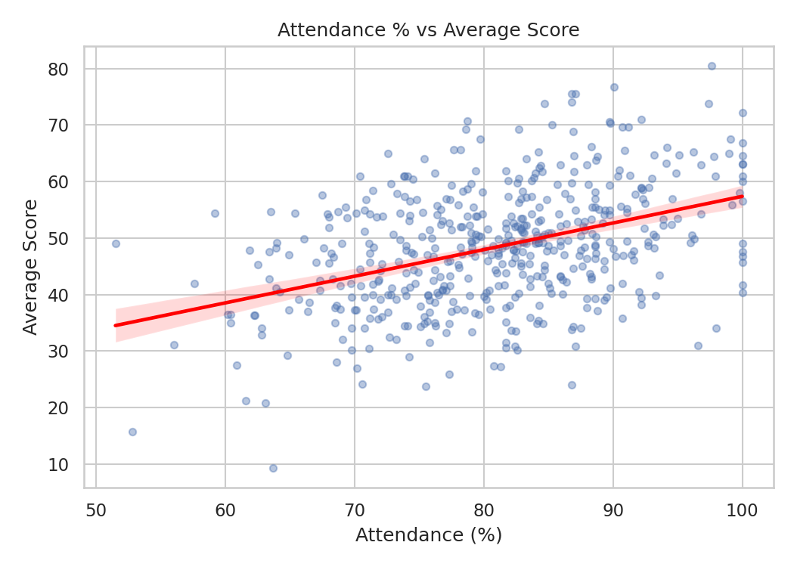
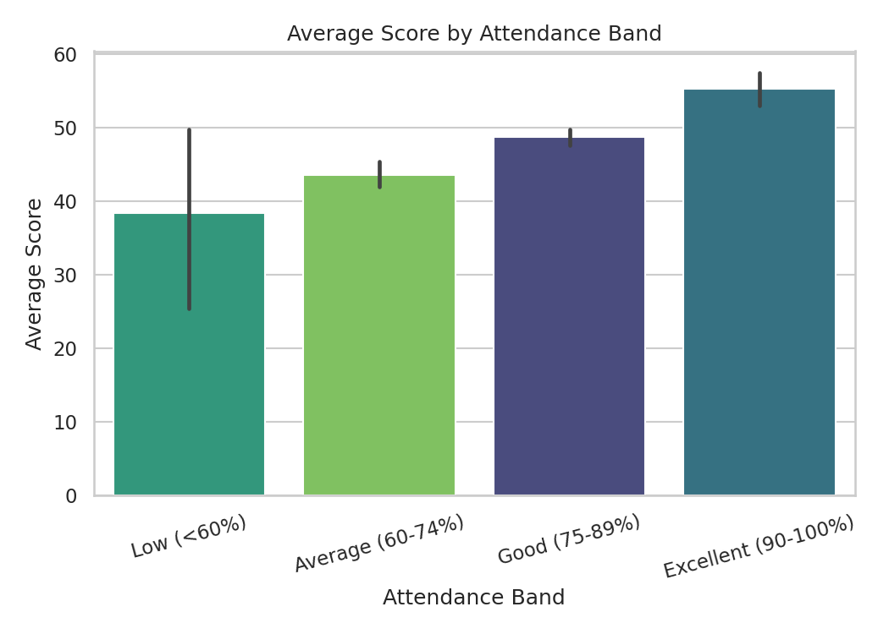
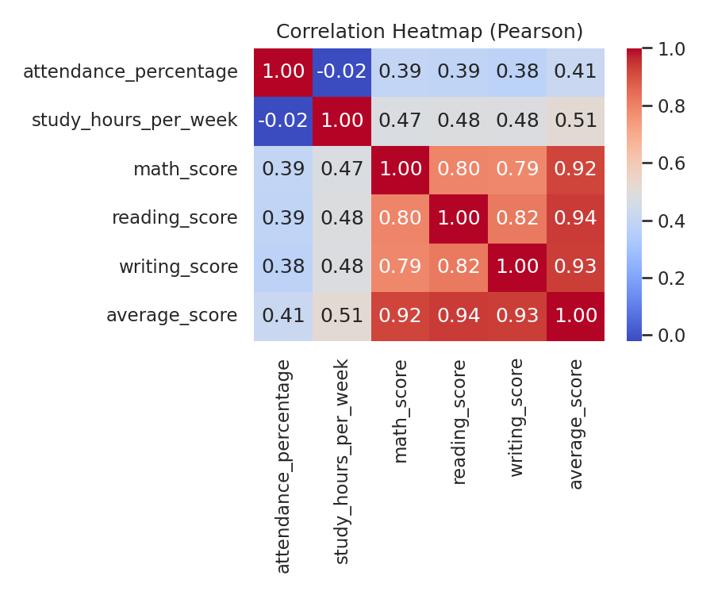
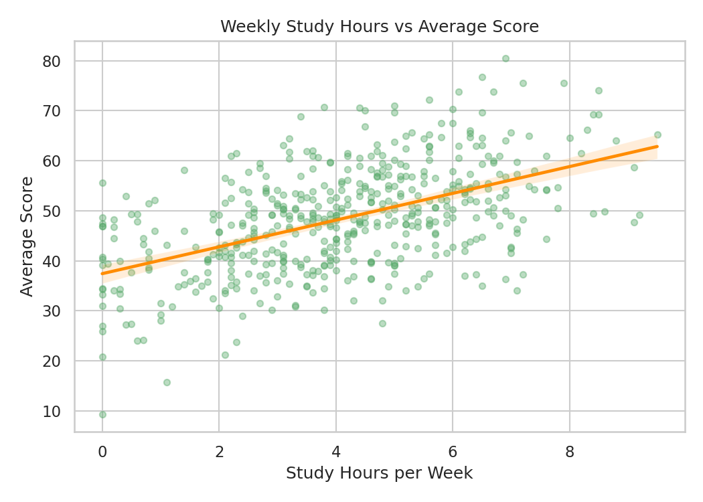
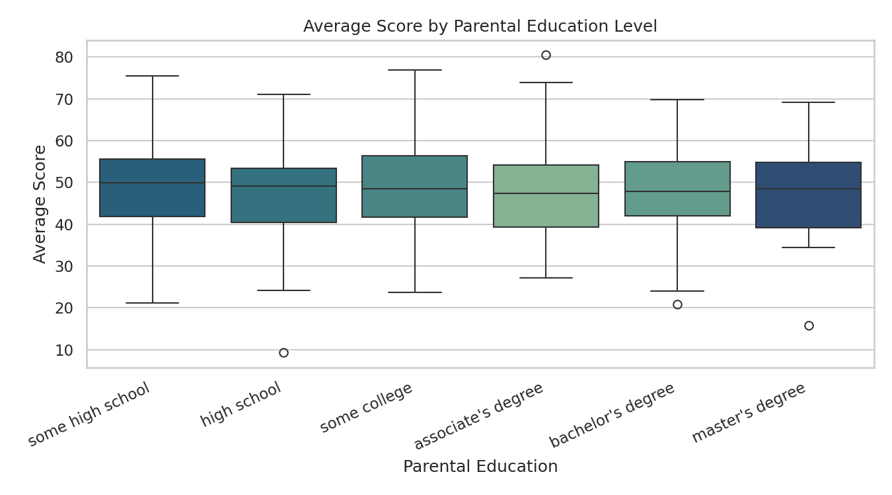
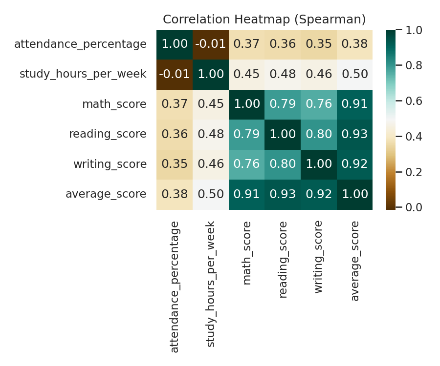

<div align="center">

# 📊 Student Performance Analysis

**A statistical analytics case study on the factors associated with academic performance**


</div>

---

## 📑 Table of Contents

- [Project Objective](#-project-objective)
- [Business Questions](#-business-questions)
- [Executive Summary](#-executive-summary)
- [Dataset](#-dataset)
- [Workflow](#-workflow)
- [Tools & Tech Stack](#-tools--tech-stack)
- [Architecture](#-architecture)
- [Statistical Methods](#-statistical-methods)
- [Performance Segmentation](#-performance-segmentation)
- [Risk Analysis](#-risk-analysis)
- [Visual Analysis](#-visual-analysis)
- [SQL Analysis](#-sql-analysis)
- [Power BI-Ready Outputs & Dashboard Guide](#-power-bi-ready-outputs--dashboard-guide)
- [Key Findings](#-key-findings)
- [Limitations](#-limitations)
- [Quick Start](#-quick-start)
- [Repository Structure](#-repository-structure)
- [License](#-license)
- [Credits](#-credits)

---

## 🎯 Project Objective

Analyze student academic performance data to identify which factors are
statistically associated with higher scores, and translate that analysis
into a segmented, decision-ready view of the student population — using a
full analytics workflow: data cleaning, exploratory and statistical
analysis, segmentation, rule-based risk flagging, SQL-based querying, and
a dashboard-ready output layer.

**Cognevance Technologies — Data Science & Data Analytics Project Series (Level 1)**

---

## ❓ Business Questions

1. Is student attendance associated with academic performance?
2. Is weekly study time associated with academic performance?
3. Does completing test preparation relate to higher scores?
4. Do demographic factors (gender, parental education) show a meaningful
   association with performance?
5. Which students fall into lower-performing segments, and how large are
   those segments?
6. Which students combine multiple low-performance indicators (low score,
   low attendance, low study time) and may warrant academic attention?

---

## 📋 Executive Summary

- **Weekly study hours** shows the strongest association with average
  score of the variables tested (Pearson r = 0.515, p < 0.001).
- **Attendance percentage** is moderately and significantly associated
  with average score (Pearson r = 0.414, p < 0.001).
- **Test preparation completion** is associated with a statistically
  significant score difference (53.6 vs. 45.4, Welch's t-test p < 0.001).
- **Parental education** shows no statistically significant association
  with average score (one-way ANOVA, p = 0.911, η² = 0.003); the gender
  difference is small relative to within-group variation.
- Segmentation identifies **51 students (10.2%) in the "At Risk"
  segment**; rule-based risk analysis flags **20 students as "High Risk"**
  on a combination of low score, low attendance, and low study hours.
- All relationships describe **statistical association, not causation**
  — see [Limitations](#-limitations).

---

## 🗂 Dataset

**This project uses a synthetically generated dataset** (`data/generate_dataset.py`),
built to match the schema of publicly available Kaggle student-performance
datasets. It was generated specifically for this project so the complete
analytics pipeline could be built, executed, and documented end-to-end.
It is **not** observational data collected from a real institution, and
findings should be read as a demonstration of methodology rather than as
claims about any real student population.

| Field | Description |
|---|---|
| `student_id` | Unique student identifier |
| `gender` | Student gender |
| `parental_education` | Highest parental education level |
| `lunch` | Lunch type (standard / free-reduced) |
| `test_preparation` | Whether the student completed a test-prep course |
| `attendance_percentage` | Attendance rate (%) |
| `study_hours_per_week` | Self-reported weekly study hours |
| `math_score`, `reading_score`, `writing_score` | Subject scores (0–100) |
| `average_score`, `grade`, `attendance_band` | Engineered during cleaning |
| `performance_segment` | Engineered during segmentation |
| `risk_level` | Engineered during risk analysis |

Full column-level documentation, including data types and expected
ranges, is in **[`data_dictionary.md`](data_dictionary.md)**.

**Records:** 500 students (post-cleaning), with 15 injected data-quality
issues (missing values, duplicate rows) resolved during preprocessing.

---

## 🔄 Workflow

```
Data Quality Check → Cleaning → Feature Engineering → EDA →
Statistical Analysis → Segmentation → Risk Analysis → SQL Analysis →
Findings & Reporting → Power BI–Ready Export
```

Every stage is implemented as its own module (see
[Repository Structure](#-repository-structure)) and reproduced end-to-end
in `notebooks/student_performance_analysis.ipynb`.

---

## 🛠 Tools & Tech Stack

| Category | Technology | Purpose |
|---|---|---|
| Language | Python 3.10+ | Core data processing and analysis |
| Data Handling | Pandas, NumPy | Cleaning, transforming, and analyzing data |
| Statistics | SciPy | Pearson/Spearman correlation, linear regression, t-tests |
| Visualization | Matplotlib, Seaborn | Statistical charts and visual analysis |
| Environment | Jupyter Notebook | Reproducible, narrated analysis |
| Querying | SQL (ANSI-compatible) | KPI, relationship, and business-question queries |
| Dashboarding | Power BI (external) | Dashboard guide provided; built from the exported CSVs — no `.pbix` file included |
| Dataset | Kaggle-style structured CSV (synthetic) | Student performance records |

---

## 🏗 Architecture

```
┌─────────────────────────┐
│      Raw Dataset          │
│   (student_data.csv)      │
└─────────────┬──────────────┘
              │
              ▼
┌─────────────────────────┐
│  Data Cleaning &            │
│  Feature Engineering         │
│  (src_01_data_cleaning.py)   │
└─────────────┬──────────────┘
              │
              ▼
┌─────────────────────────┐
│  EDA & Statistical Analysis  │
│  (src_02_analysis_visualization.py)│
└─────────────┬──────────────┘
              │
    ┌─────────┴─────────┐
    ▼                     ▼
┌───────────────┐   ┌───────────────┐
│ Segmentation     │   │ Risk Analysis   │
│ (src_04_*.py)    │   │ (src_05_*.py)   │
└───────┬───────┘   └───────┬───────┘
        │                     │
        └──────────┬──────────┘
                    ▼
        ┌─────────────────────┐
        │   SQL Analysis          │
        │   (sql/*.sql)            │
        └─────────┬───────────┘
                    │
                    ▼
        ┌─────────────────────┐
        │   Findings Report         │
        │   (PROJECT_REPORT.md)     │
        └─────────┬───────────┘
                    │
                    ▼
        ┌─────────────────────┐
        │   Power BI–Ready CSVs      │
        │   (segmented, risk output)  │
        └─────────────────────┘
```

---

## 🧪 Statistical Methods

| Method | Purpose |
|---|---|
| Descriptive statistics | Mean, std. dev., quartiles, skew for all numeric fields |
| Pearson correlation | Linear association between score and attendance / study hours |
| Spearman correlation | Monotonic, rank-based association (robustness check on Pearson) |
| Simple linear regression (OLS) | Slope, intercept, R², and significance for each single-variable model |
| Welch's t-test | Significance of the test-preparation score difference |
| One-way ANOVA | Significance of average-score differences across the six parental-education categories |
| Group-wise aggregation | Mean/std./count by gender, test-prep, attendance band, parental education |

**All coefficients are reported with their p-values, and all language is
restricted to statistical association — no causal or predictive claims
are made.** See [`report/PROJECT_REPORT.md`](report/PROJECT_REPORT.md)
for full results.

---

## 🧩 Performance Segmentation

Students are grouped into four score-based segments (`src_04_segmentation.py`):

| Segment | Score Range | Students | Avg. Score | Avg. Attendance | Avg. Study Hours |
|---|---|---|---|---|---|
| At Risk | < 35 | 51 (10.2%) | 30.4 | 75.0% | 2.1 hrs |
| Needs Attention | 35–45 | 131 (26.2%) | 40.3 | 78.0% | 3.4 hrs |
| Moderate | 45–60 | 249 (49.8%) | 51.6 | 81.8% | 4.4 hrs |
| High Performer | ≥ 60 | 69 (13.8%) | 65.5 | 87.7% | 5.7 hrs |

Thresholds were set from this dataset's own score distribution (see
`data_dictionary.md`) — this is a descriptive grouping for reporting, not
a predictive classification.

---

## 🚩 Risk Analysis

`src_05_risk_analysis.py` flags students combining low score with low
attendance and/or low study hours, using fixed, documented thresholds:

| Risk Level | Criteria | Students |
|---|---|---|
| High Risk | Low score **and** low attendance **and** low study hours | 20 |
| Medium Risk | Low score **and** (low attendance **or** low study hours) | 65 |
| Watch | Low score only | 25 |
| No Risk Indicated | Score not low | 390 |

**These are project-defined analytical indicators, not predictions.**
Full output: [`data/risk_analysis.csv`](data/risk_analysis.csv).

---

## 📊 Visual Analysis

| | |
|---|---|
|  |  |
|  |  |
|  |  |
|  |  |
|  | |

---

## 🗃 SQL Analysis

Three SQL files using broadly portable SQL syntax, validated against SQLite, query the cleaned,
segmented, and risk-flagged tables directly. Every query was validated
by executing it against SQLite; the syntax is expected to be compatible
with PostgreSQL and MySQL as well, though those engines were not
independently tested (see per-file header comments for engine-specific
notes, e.g. `STDDEV()`).

| File | Covers |
|---|---|
| [`sql/01_basic_analysis.sql`](sql/01_basic_analysis.sql) | Core KPIs — student count, average score/attendance, score stats, grade distribution, test-prep completion |
| [`sql/02_performance_analysis.sql`](sql/02_performance_analysis.sql) | Relationships between performance and attendance, study hours, gender, test preparation, and performance segments |
| [`sql/03_business_questions.sql`](sql/03_business_questions.sql) | Direct answers to this project's business questions, including High/Medium risk student lists |

---

## 📈 Power BI-Ready Outputs & Dashboard Guide

**No Power BI file (`.pbix`) is included in this repository.** Instead,
two dashboard-ready CSVs are exported for direct import into Power BI —
no code dependency required — along with a written guide below for
building the dashboard:

- **`data/student_data_segmented.csv`** — full student-level dataset with `performance_segment`
- **`data/risk_analysis.csv`** — student-level risk flags and `risk_level`

**Recommended KPI cards:**
- Total Students · Average Score · Average Attendance % · Pass Rate %
- Students by Performance Segment (count and %)
- Students in High Risk / Medium Risk (count and %)

**Recommended filters (slicers):**
- `performance_segment`, `risk_level`, `gender`, `test_preparation`, `attendance_band`, `parental_education`

**Recommended visuals:**
- Bar chart — average score by `performance_segment`
- Bar chart — average score by `attendance_band`
- Scatter plot — `attendance_percentage` vs. `average_score`, colored by `performance_segment`
- Donut/pie chart — `risk_level` distribution
- Table — High Risk / Medium Risk student list with score, attendance, and study hours
- Bar chart — average score by `test_preparation`

---

## 🔑 Key Findings

1. Attendance and weekly study hours are both **positively and
   significantly associated** with average score (Pearson r = 0.414 and
   r = 0.515 respectively, both p < 0.001).
2. Study hours show a **stronger association** with score than attendance,
   based on correlation strength and regression R² (26.5% vs. 17.2%).
3. Students who completed test preparation scored significantly higher on
   average (53.6 vs. 45.4, Welch's t-test p < 0.001).
4. Parental education shows **no statistically significant association**
   with average score (one-way ANOVA, p = 0.911, η² = 0.003). The gender
   difference is small relative to within-group variation and is not
   treated as a meaningful finding.
5. Segmentation and risk analysis together identify a concentrated
   "High Risk" subgroup of 20 students combining low score, low
   attendance, and low study hours — a candidate group for targeted
   review.

Full statistical detail, including all coefficients, p-values, and
group-wise tables: **[`report/PROJECT_REPORT.md`](report/PROJECT_REPORT.md)**.

---

## ⚠️ Limitations

- **Synthetic data** — findings describe patterns in a synthetically
  generated dataset built for this project, not real student records.
  Relationships were partly built into the data-generation process
  itself, so results should not be generalized to real institutions.
- **Correlation, not causation** — no causal claims are made or supported
  by this analysis.
- **No predictive modeling** — the regression models are simple,
  single-variable, descriptive fits, not validated predictive models.
- **Segmentation and risk thresholds are project-defined**, not
  externally validated or benchmarked against an institutional standard.
- **Single snapshot** — the dataset represents one point in time; no
  trend or longitudinal analysis was performed.

---

## 🚀 Quick Start

All outputs — cleaned/segmented/risk-flagged datasets, nine charts, the
executed notebook, and the written report — are pre-generated and
committed to this repository. No installation or execution is required
to review the results; open `notebooks/student_performance_analysis.ipynb`
or `report/PROJECT_REPORT.md` directly.

To reproduce the full pipeline from source:

```bash
git clone https://github.com/<your-username>/cognevance_studentPerformanceAnalysis.git
cd cognevance_studentPerformanceAnalysis
pip install -r requirements.txt

python data/generate_dataset.py
python src_01_data_cleaning.py
python src_02_analysis_visualization.py
python src_04_segmentation.py
python src_05_risk_analysis.py
python src_03_insights_report.py
```

---

## 📁 Repository Structure

```
cognevance_studentPerformanceAnalysis/
├── data/
│   ├── generate_dataset.py          # dataset generation module
│   ├── student_data.csv             # raw dataset
│   ├── student_data_clean.csv       # cleaned dataset
│   ├── student_data_segmented.csv   # segmented dataset (Power BI-ready)
│   ├── segment_summary.csv          # per-segment summary statistics
│   └── risk_analysis.csv            # risk-flagged dataset (Power BI-ready)
├── notebooks/
│   └── student_performance_analysis.ipynb   # full executed workflow
├── charts/                          # 9 exported PNG visualizations
├── sql/
│   ├── 01_basic_analysis.sql
│   ├── 02_performance_analysis.sql
│   └── 03_business_questions.sql
├── report/
│   └── PROJECT_REPORT.md            # full analytics case study
├── src_01_data_cleaning.py
├── src_02_analysis_visualization.py # EDA, statistics, regression, charts
├── src_03_insights_report.py        # report generation module
├── src_04_segmentation.py           # performance segmentation module
├── src_05_risk_analysis.py          # risk analysis module
├── data_dictionary.md               # full column documentation
├── requirements.txt
├── LICENSE
└── README.md
```

---

## 📄 License

This project is licensed under the **MIT License**.

## 🙌 Credits

- **Author:** Roshni Kumari
- **Program:** Cognevance Technologies — Data Science & Data Analytics Project Series
