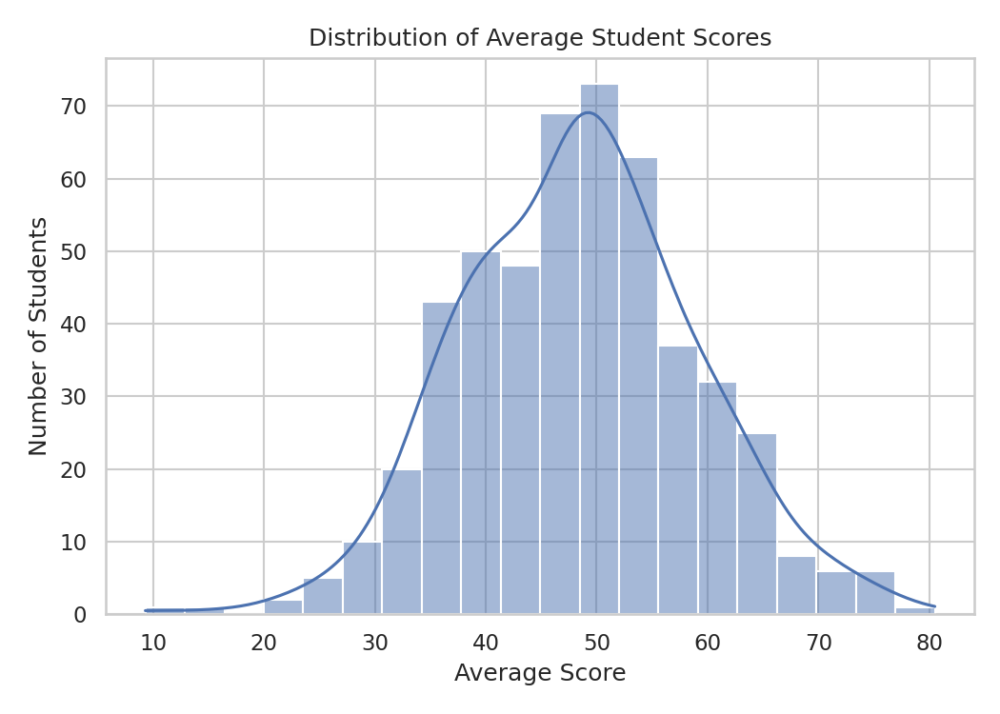
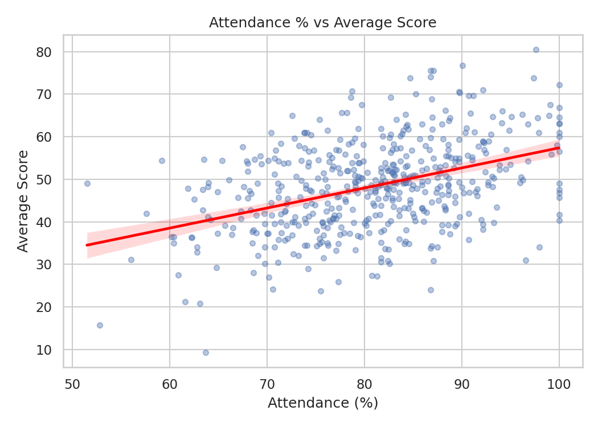
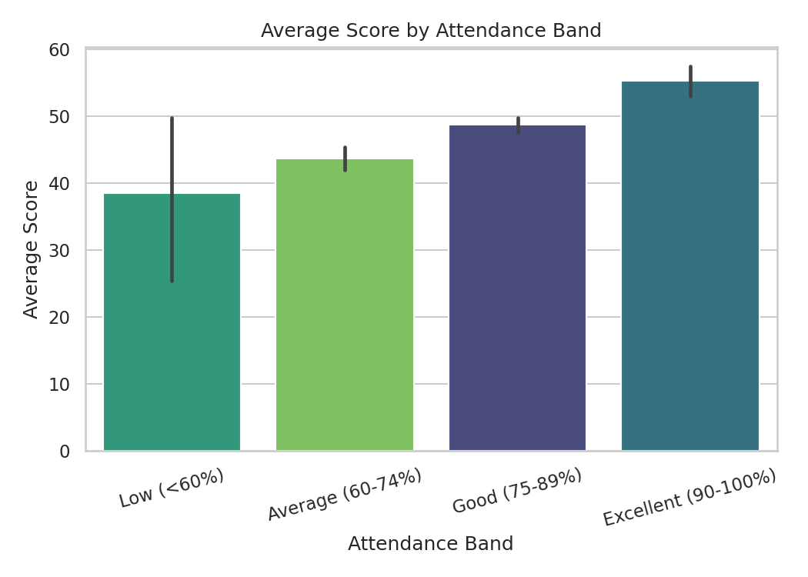
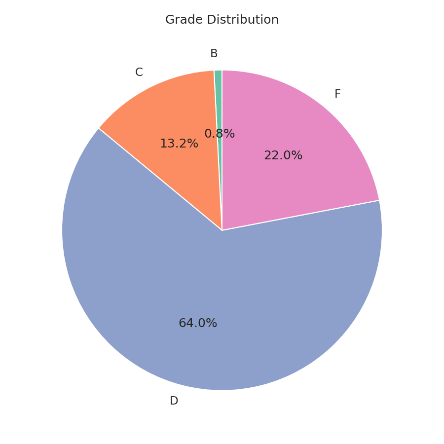
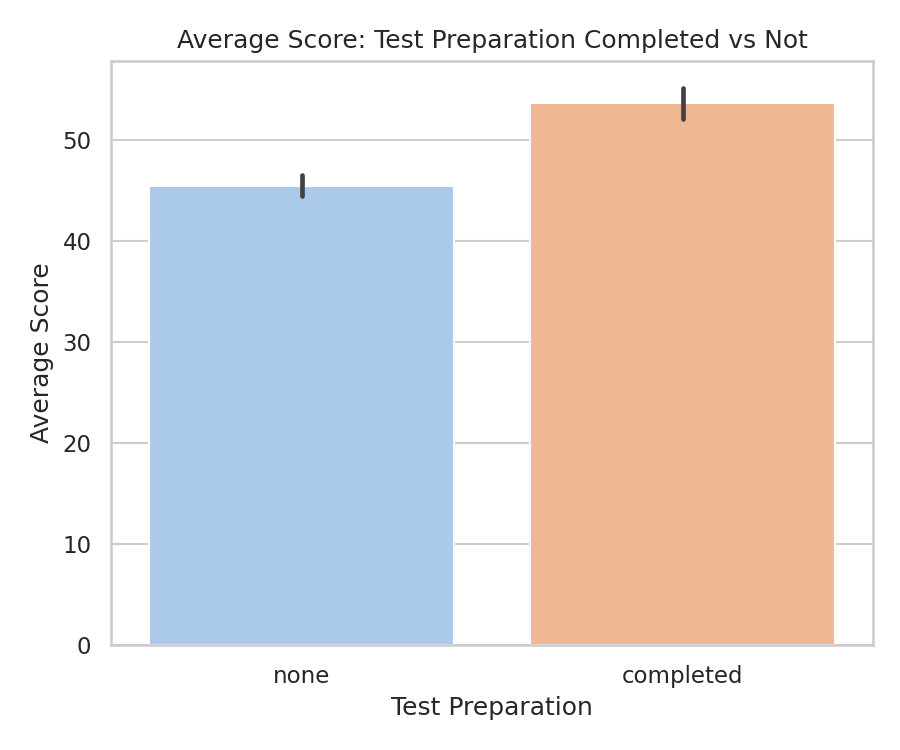
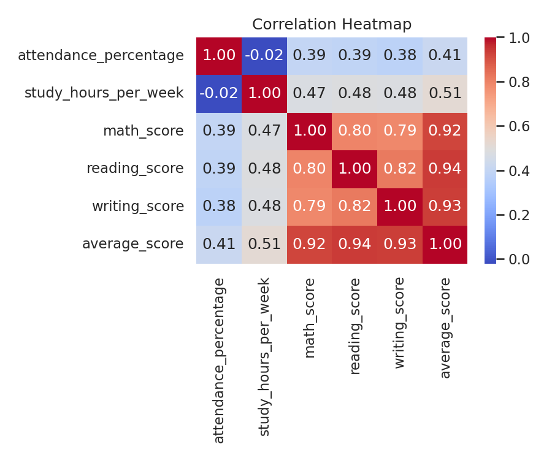

<div align="center">

# 📊 Student Performance Analysis

**A data-driven study of the factors influencing academic performance**


</div>

---

## 📑 Table of Contents

- [Overview](#-overview)
- [Executive Summary](#-executive-summary)
- [Dataset](#-dataset)
- [Methodology](#-methodology)
- [Features](#-features)
- [Tech Stack](#-tech-stack)
- [Architecture](#-architecture)
- [Visual Analysis](#-visual-analysis)
- [Key Metrics](#-key-metrics)
- [Quick Start](#-quick-start)
- [Repository Structure](#-repository-structure)
- [License](#-license)
- [Credits](#-credits)

---

## 🔎 Overview

This project analyzes student academic performance data to identify the
factors most strongly associated with higher scores. It covers the full
analytics lifecycle — data cleaning, exploratory data analysis, statistical
correlation, visualization, and a written findings report — applied to a
500-record student dataset.

**Cognevance Technologies — Data Science & Data Analytics Project Series (Level 1)**

---

## 📋 Executive Summary

- **Weekly study hours** is the strongest single predictor of average score (r = 0.52).
- **Attendance percentage** is moderately correlated with average score (r = 0.41); students in the "Excellent" attendance band (90–100%) average **55.3**, versus **38.5** for students below 60%.
- **Test preparation completion** is associated with an **8.2-point** average score increase.
- **Gender** shows a negligible performance gap (female 49.0 vs. male 47.8), indicating it is not a meaningful predictor in this dataset.
- Overall pass rate across the analyzed cohort: **78.0%**.

---

## 🗂 Dataset

| Field | Description |
|---|---|
| `student_id` | Unique student identifier |
| `gender` | Student gender |
| `parental_education` | Highest parental education level |
| `lunch` | Lunch type (standard / free-reduced) |
| `test_preparation` | Whether the student completed a test-prep course |
| `attendance_percentage` | Attendance rate (%) |
| `study_hours_per_week` | Self-reported weekly study hours |
| `math_score`, `reading_score`, `writing_score` | Subject scores (0–100) |
| `average_score`, `grade`, `attendance_band` | Engineered during cleaning |

**Records:** 500 students (post-cleaning), structured consistent with public Kaggle student-performance datasets, with 15 injected data-quality issues (missing values, duplicate rows) resolved during preprocessing.

---

## 🧪 Methodology

1. **Data Cleaning** — removed duplicate rows and duplicate IDs, imputed missing numeric values using the column median, clipped out-of-range values, standardized categorical text.
2. **Feature Engineering** — derived `average_score`, letter `grade` (A–F), and `attendance_band` (Low / Average / Good / Excellent).
3. **Exploratory Analysis** — descriptive statistics, Pearson correlation between attendance/study hours and score, group-wise comparisons by gender, test-preparation status, and attendance band.
4. **Visualization** — six charts covering distribution, correlation, and comparative analysis.
5. **Reporting** — findings compiled into a structured report with statistically supported conclusions.

---

## ✨ Features

#### 🧹 Data Cleaning & Preprocessing
- Automated handling of missing values, duplicates, and inconsistent formatting

#### 📈 Exploratory Data Analysis
- Descriptive statistics and correlation analysis across attendance, study hours, and scores

#### 📊 Visualization
- Six publication-ready charts: distribution, regression, comparative bar charts, pie chart, and correlation heatmap

#### 📝 Reporting
- Structured Markdown report with executive findings and supporting statistics

---

## 🛠 Tech Stack

| Category | Technology | Purpose |
|---|---|---|
| Language | Python 3.10+ | Core data processing and analysis |
| Data Handling | Pandas, NumPy | Cleaning, transforming, and analyzing data |
| Visualization | Matplotlib, Seaborn | Statistical charts and trend visualization |
| Environment | Jupyter Notebook | Reproducible, narrated analysis |
| Dataset | Kaggle-style structured CSV | Student performance records |

---

## 🏗 Architecture

```
┌───────────────────────┐
│      Raw Dataset        │
│   (student_data.csv)    │
└───────────┬─────────────┘
            │
            ▼
┌───────────────────────┐
│   Data Cleaning &        │
│   Preprocessing           │
│   (Pandas)                 │
└───────────┬─────────────┘
            │
            ▼
┌───────────────────────┐
│   Exploratory Data        │
│   Analysis (EDA)           │
└───────────┬─────────────┘
            │
            ▼
┌───────────────────────┐
│   Visualization             │
│   (Matplotlib / Seaborn)    │
└───────────┬─────────────┘
            │
            ▼
┌───────────────────────┐
│   Findings Report            │
│   (PROJECT_REPORT.md)        │
└───────────────────────┘
```

---

## 📊 Visual Analysis

| | |
|---|---|
|  |  |
|  |  |
|  |  |

---

## 📈 Key Metrics

| Metric | Value |
|---|---|
| Records analyzed (post-cleaning) | 500 |
| Overall average score | 48.4 |
| Correlation — attendance % ↔ average score | 0.41 |
| Correlation — study hours ↔ average score | 0.52 |
| Pass rate | 78.0% |
| Test-preparation score lift | +8.2 points |

---

## 🚀 Quick Start

All outputs — the cleaned dataset, six charts, the executed notebook, and the written report — are pre-generated and committed to this repository. No installation or execution is required to review the results; open `notebooks/student_performance_analysis.ipynb` or `report/PROJECT_REPORT.md` directly.

To reproduce the pipeline from source:

```bash
git clone https://github.com/<your-username>/cognevance_studentPerformanceAnalysis.git
cd cognevance_studentPerformanceAnalysis
pip install -r requirements.txt

python data/generate_dataset.py
python src_01_data_cleaning.py
python src_02_analysis_visualization.py
python src_03_insights_report.py
```

---

## 📁 Repository Structure

```
cognevance_studentPerformanceAnalysis/
├── data/
│   ├── generate_dataset.py       # dataset generation module
│   ├── student_data.csv          # raw dataset
│   └── student_data_clean.csv    # cleaned dataset
├── notebooks/
│   └── student_performance_analysis.ipynb   # full executed analysis notebook
├── charts/                       # six exported PNG visualizations
├── report/
│   └── PROJECT_REPORT.md         # findings and analysis report
├── src_01_data_cleaning.py       # cleaning & preprocessing module
├── src_02_analysis_visualization.py   # EDA and chart generation module
├── src_03_insights_report.py     # report generation module
├── requirements.txt
└── README.md
```

---

## 📄 License

This project is licensed under the **MIT License**.

## 🙌 Credits

- **Author:** Roshni Kumari
- **Program:** Cognevance Technologies — Data Science & Data Analytics Project Series
